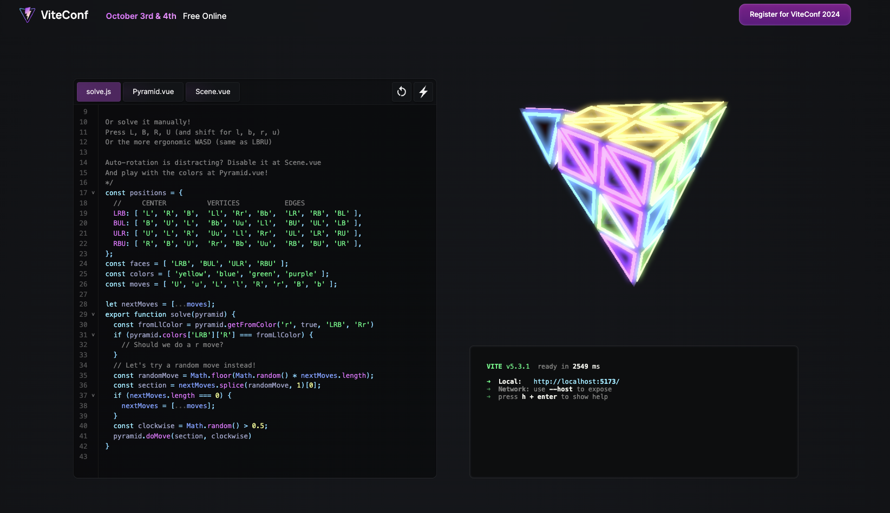

<p align="center">
  <a href="https://www.npmjs.com/package/@tresjs/core"></a>
  <a href="https://www.npmjs.com/package/three"></a>
  <a href="https://viteconf.org/"></a>
</p>

# Viteconf Pyraminx

> Collaboration between [StackBlitz](https://stackblitz.com/) and [Tres.js](https://tresjs.org) for [Viteconf 2024](https://viteconf.org/)

Are you ready to solve the puzzle? △ 😎



## Steps

1. Go to [Viteconf Landing](https://viteconf.org/)
2. Below the 3D Pyraminx, click on the "Code!" button.
3. Check the instructions on the `solve.js` file.
4. You can check the 3D components on `Pyramind.vue` and `Scene.vue` file.
5. Have fun and good luck!


## Solve the puzzle

```javascript
/* Can you do better than a random solver?

pyramid.
  colors -> { face: { position: Color }}
  getColor(face, position) -> Color
  getFromColor(section, cw, face, position) -> Color
  getFromFacePosition(section, cw, face, position) -> [face, position]
  doMove(section, cw)

Or solve it manually!
Press L, B, R, U (and shift for l, b, r, u)
Or the more ergonomic WASD (same as LBRU)

Auto-rotation is distracting? Disable it at Scene.vue
And play with the colors at Pyramid.vue!
*/
const positions = {
  //     CENTER          VERTICES           EDGES
  LRB: [ 'L', 'R', 'B',  'Ll', 'Rr', 'Bb',  'LR', 'RB', 'BL' ],
  BUL: [ 'B', 'U', 'L',  'Bb', 'Uu', 'Ll',  'BU', 'UL', 'LB' ],
  ULR: [ 'U', 'L', 'R',  'Uu', 'Ll', 'Rr',  'UL', 'LR', 'RU' ],
  RBU: [ 'R', 'B', 'U',  'Rr', 'Bb', 'Uu',  'RB', 'BU', 'UR' ],
};
const faces = [ 'LRB', 'BUL', 'ULR', 'RBU' ];
const colors = [ 'yellow', 'blue', 'green', 'purple' ];
const moves = [ 'U', 'u', 'L', 'l', 'R', 'r', 'B', 'b' ];

let nextMoves = [...moves];
export function solve(pyramid) {
  const fromLlColor = pyramid.getFromColor('r', true, 'LRB', 'Rr')
  if (pyramid.colors['LRB']['R'] === fromLlColor) {
    // Should we do a r move?
  }
  // Let's try a random move instead!
  const randomMove = Math.floor(Math.random() * nextMoves.length);
  const section = nextMoves.splice(randomMove, 1)[0];
  if (nextMoves.length === 0) {
    nextMoves = [...moves];
  }
  const clockwise = Math.random() > 0.5;
  pyramid.doMove(section, clockwise)
}
```


## Install

```bash
pnpm install
```

## Run

```bash
pnpm dev
```

## Build

```bash
pnpm build
```

## License

MIT © [StackBlitz](https://stackblitz.com/) and [Tres.js](https://tresjs.org). Check the [LICENSE](./LICENSE) file for more information.
