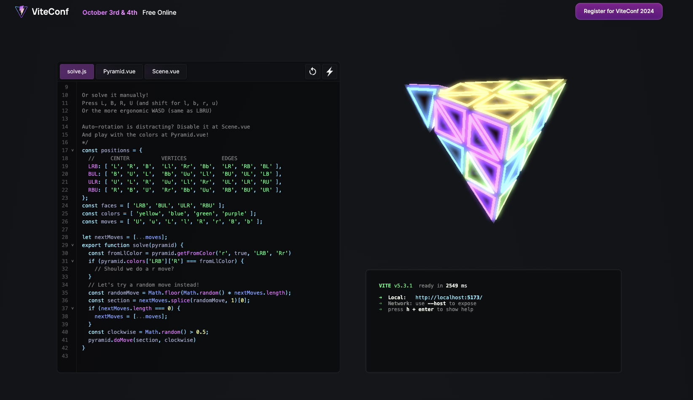

<p align="center">
  <a href="https://www.npmjs.com/package/@tresjs/core"></a>
  <a href="https://www.npmjs.com/package/three"></a>
  <a href="https://viteconf.org/"></a>
</p>

# Viteconf Pyraminx

> Collaboration between [StackBlitz](https://stackblitz.com/) and [Tres.js](https://tresjs.org) for [Viteconf 2024](https://viteconf.org/)

Are you ready to solve the puzzle? △ 😎



## Steps

1. Go to [Viteconf Landing](https://viteconf.org/)
2. Below the 3D Pyraminx, click on the "Code!" button.
3. Check the instructions on the `solve.js` file.
4. You can check the 3D components on `Pyramind.vue` and `Scene.vue` file.
5. Have fun and good luck!


## Solve the puzzle

```javascript
/* Can you do better than a random solver?

pyramid.
  colors -> { face: { position: Color }}
  getColor(face, position) -> Color
  getFromColor(section, cw, face, position) -> Color
  getFromFacePosition(section, cw, face, position) -> [face, position]
  doMove(section, cw)

Or solve it manually!
Press L, B, R, U (and shift for l, b, r, u)
Or the more ergonomic WASD (same as LBRU)

Auto-rotation is distracting? Disable it at Scene.vue
And play with the colors at Pyramid.vue!
*/
const positions = {
  //     CENTER          VERTICES           EDGES
  LRB: [ 'L', 'R', 'B',  'Ll', 'Rr', 'Bb',  'LR', 'RB', 'BL' ],
  BUL: [ 'B', 'U', 'L',  'Bb', 'Uu', 'Ll',  'BU', 'UL', 'LB' ],
  ULR: [ 'U', 'L', 'R',  'Uu', 'Ll', 'Rr',  'UL', 'LR', 'RU' ],
  RBU: [ 'R', 'B', 'U',  'Rr', 'Bb', 'Uu',  'RB', 'BU', 'UR' ],
};
const faces = [ 'LRB', 'BUL', 'ULR', 'RBU' ];
const colors = [ 'yellow', 'blue', 'green', 'purple' ];
const moves = [ 'U', 'u', 'L', 'l', 'R', 'r', 'B', 'b' ];

let nextMoves = [...moves];
export function solve(pyramid) {
  const fromLlColor = pyramid.getFromColor('r', true, 'LRB', 'Rr')
  if (pyramid.colors['LRB']['R'] === fromLlColor) {
    // Should we do a r move?
  }
  // Let's try a random move instead!
  const randomMove = Math.floor(Math.random() * nextMoves.length);
  const section = nextMoves.splice(randomMove, 1)[0];
  if (nextMoves.length === 0) {
    nextMoves = [...moves];
  }
  const clockwise = Math.random() > 0.5;
  pyramid.doMove(section, clockwise)
}
```


## Install

```bash
pnpm install
```

## Run

```bash
pnpm prepare-pyramid
pnpm dev
```

## WebContainer Loading Optimizations

Instead of loading the source code into the WebContainer, and then installing the dependencies, the game uses [an optimization that the Svelte team developed](https://github.com/sveltejs/learn.svelte.dev/blob/main/scripts/create-common-bundle/index.js) while building the [SvelteKit Tutorial](https://learn.svelte.dev/tutorial/introducing-sveltekit). The `prepare-pyramid` command generates a zip file with the Pyramid source code and the needed dependencies already installed. We load this zip into the webcontainer and unzip, avoiding the need to call `npm install`. The zip file also includes the `.vite` cache directory with the pre-bundled dependencies, so when we skip the optimization step on each run and the `npm run dev` command directly runs a warm start for the app (the _metadata.json hash needs to be tweaked for this to work to match the one that is generated inside the WC). This isn't needed in general when working with WebContainers API. You can glob the app folder and load their contents to mount them into the WebContainer instance, and it was done as an exploration of what was possible. Read the [WebContainers docs](https://webcontainers.io/guides/working-with-the-file-system#working-with-the-file-system) for more information.

## License

MIT © [StackBlitz](https://stackblitz.com/) and [Tres.js](https://tresjs.org). Check the [LICENSE](./LICENSE) file for more information.
